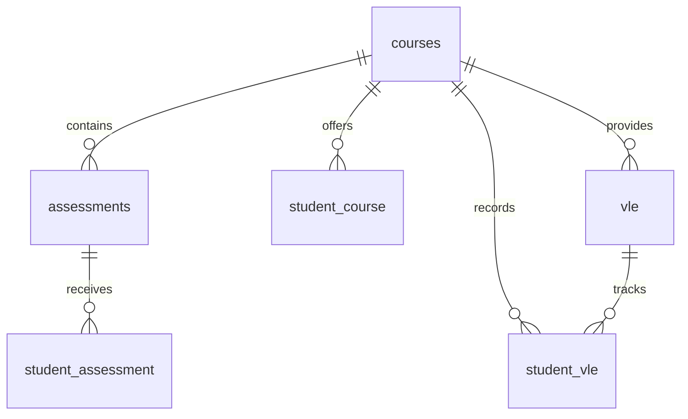

# Student Success Analytics | PostgreSQL

## Project Overview

This project explores student academic performance and engagement using the Open University Learning Analytics Dataset (OULAD).

I designed and implemented a relational database in PostgreSQL to organize student demographics, course registrations, assessments, and virtual learning environment (VLE) activity.

Using SQL, I analyze student performance, assessment scores, course outcomes, and engagement patterns to uncover insights into student success.

## Project Objectives

* Design and implement a relational database using PostgreSQL.
* Import, clean, and validate large educational datasets.
* Analyze student performance and engagement using advanced SQL.
* Apply CTEs, subqueries, window functions, and aggregations to answer analytical questions.
* Demonstrate practical data modeling and data quality techniques.

## Technologies Used

* **Database:** PostgreSQL
* **Database Management:** pgAdmin 4
* **Language:** SQL
* **Dataset:** Open University Learning Analytics Dataset (OULAD)

  ## Database Schema

The project uses a PostgreSQL relational database containing six tables from the Open University Learning Analytics Dataset (OULAD).

The database integrates course information, student demographics, assessment results, and virtual learning environment (VLE) activity to support analysis of student performance and engagement.

### Database Tables

| Table                | Description                                                                         |
| -------------------- | ----------------------------------------------------------------------------------- |
| `courses`            | Stores course information and presentation details.                                 |
| `assessments`        | Contains assessment metadata, including assessment type and weight.                 |
| `student_assessment` | Records student assessment submissions and scores.                                  |
| `student_course`     | Contains student demographics, registration information, and final course outcomes. |
| `student_vle`        | Stores student interactions with online learning resources.                         |
| `vle`                | Contains metadata describing virtual learning resources.                            |

### Data Modeling and Design

The database was designed to support efficient querying and maintain relationships between students, courses, assessments, and learning activities.

Key design considerations include:

* Using course module and presentation identifiers to distinguish course offerings.
* Establishing appropriate primary and foreign keys to maintain referential integrity.
* Addressing duplicate records during data preparation.
* Introducing a surrogate key for `student_vle` because the original activity fields did not provide a reliable unique identifier.

### Primary Keys, Foreign Keys, and Data Integrity

The database uses primary and foreign key constraints to preserve data integrity and establish relationships between course offerings, student assessments, and online learning activity.

**Key design decisions:**

* **Composite keys:** Course offerings are identified using `code_module` and `code_presentation`, allowing the same module to appear in different presentations.
* **Assessment identification:** Each assessment has a unique `id_assessment`, while student assessment records use a composite primary key.
* **Surrogate key:** A generated `student_vle_id` was introduced to identify individual student activity records uniquely.
* **Referential integrity:** Foreign key constraints connect assessments, course offerings, and VLE resources to their related tables.

These design decisions support reliable joins, reduce ambiguity, and provide a structured foundation for analyzing student performance and engagement.

* Validating data integrity after loading the source files.

The relational schema provides the foundation for advanced SQL analysis of academic performance and student engagement.

### Entity Relationship Diagram

